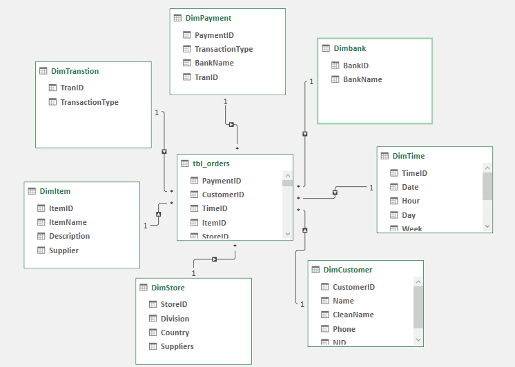
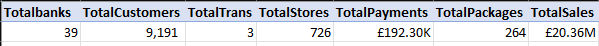
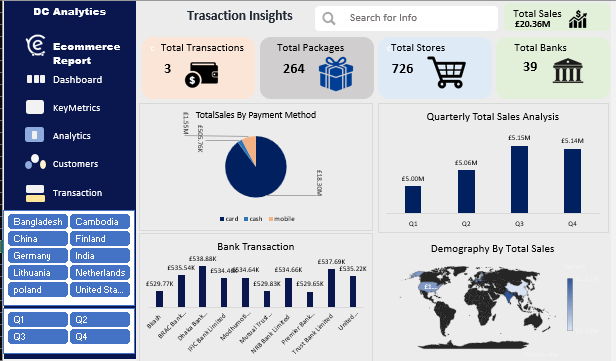
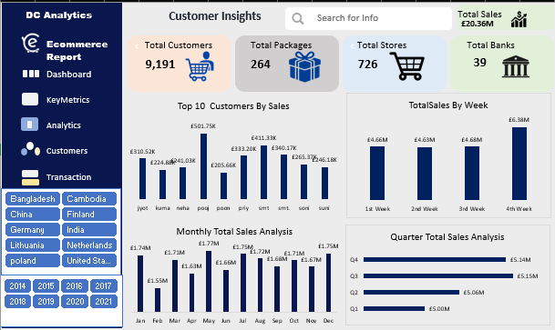

## Introduction
this project is basically an Ecommerce company project which entails a large datasets about 195,000 records. with 1 factable and 7 dimtable 
furthermore the aim and objectives is discussed below:
## Problem Statements
1.	Total Customers that purchased items over a period of time 
2.	Total Packages that were sold out
3.	Total Stores that packages were shipped in and out
4.	Total Transactions made by customers and suppliers
5.	Total banks that intiated the product transaction
6.	Total Revenue generated
## Skills / Concepts demonstrated
this is a fully-fledged excel project. The skill demonstrated is as follows:
page navigation
filter
dax
modelling
## Data modelling
The model use is star schema. The data modelling process was performed basically among 
7dimension tables and 1 factable and was joined with one to many relationships

## Data aggregation
this ensures descriptive metrics are calculated for over a long of time by grouping related data

## Data Visualation
this visually give a general overview of what happened in the ecommerce sector over a period of time

## Recommendations
Total Customers : 9191
Total Packages: 264
Total Stores: 726
Total Bank: 39
Total Transactions: 3
Total Sales:  £20.36M

Customer Performance: Customers with the highest sales should be focused on and knowing why the customers with lowest sales gave us low patronage
1.Product Performance: the top performing products purchased by the customers based on the
human needs should be focused on and ensure the availability of this product anytime purchase is made might improve the performance of the product
2.Seasonal Demand and Supply:  focus on the season where more sellers and buyers come
together for transactions understand the reason why massive transaction was made during this period and ensure the availability of the product at any point in time
3.Payment Method Performance: focus on payment method that intiates faster transaction, 
by so doing exchange between seller and buyer can be smooth and faster without delays and focusing on those banks with on-time transaction could be helpful 

